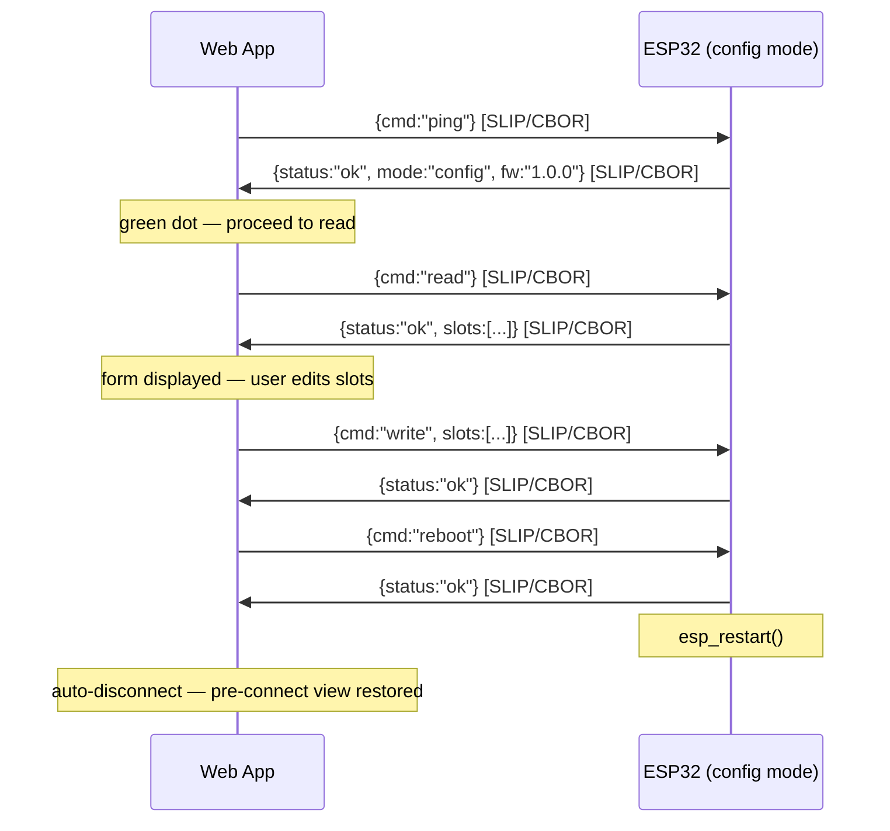
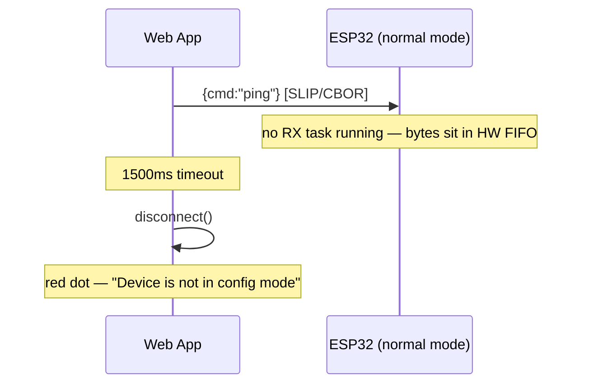

# Web Serial + CBOR button configurator

**Beads issue**: Matter-M5CoreInk-Switch-kc5

## Context
The 16-button NVS config (button_name, room_name, enabled) currently has no user-facing way to be changed. We need a browser-based configuration tool that connects via serial to read/write the button config, then reboots the device. The ESP32-PICO-D4 uses a CP2104/CH9102F USB-serial bridge (no native USB), so we use the **Web Serial API** (not WebUSB). The serial protocol uses **CBOR** (TinyCBOR already available as `espressif__cbor`) with SLIP framing to distinguish binary commands from text log lines.

## Architecture

```
Browser (Web Serial API)  ←→  UART0 @ 115200  ←→  ESP32 command handler
         ↓                                              ↓
   web/index.html                              main/app_serial.cpp
   (CBOR + SLIP)                               (CBOR + SLIP + NVS)
```

## Serial Protocol

### Framing: SLIP (RFC 1055)
Binary CBOR payloads are wrapped in SLIP frames to separate them from ASCII log output:
- `0xC0` = frame END delimiter
- `0xDB 0xDC` = escaped `0xC0`
- `0xDB 0xDD` = escaped `0xDB`

The web app scans the byte stream: anything between two `0xC0` delimiters is a SLIP-decoded CBOR message. All other bytes (ASCII log lines) are ignored (or optionally displayed in a console pane).

### Commands (web → device)

**Ping (handshake):**
```cbor
{ "cmd": "ping" }
```

**Read all slots:**
```cbor
{ "cmd": "read" }
```

**Write slots:**
```cbor
{ "cmd": "write", "slots": [ { "l1a": "Kitchen", "l1b": "Light", "l2": "Living Rm", "en": true }, ... ] }
```
(Full array of 16 entries required. `l1b` may be empty string `""` if the button name is a single word.)

**Reboot:**
```cbor
{ "cmd": "reboot" }
```

### Responses (device → web)

**Ping response:**
```cbor
{ "status": "ok", "mode": "config", "fw": "1.0.0" }
```

**Read response:**
```cbor
{ "status": "ok", "slots": [ { "l1a": "Button", "l1b": "01", "l2": "Room 01", "en": true }, ... ] }
```
(Array of 16 entries, index = slot number. `l1b` may be empty string.)

**Write response:**
```cbor
{ "status": "ok" }
```
or
```cbor
{ "status": "error", "msg": "slot 3 l1a empty" }
```

**After successful write + reboot command:** device calls `esp_restart()`.

### Handshake / Config Mode Detection

After opening the serial port, the webapp sends `ping` before doing anything else. This detects whether the device is in config mode.

**Why this is needed:** In normal (Matter) mode, no UART RX task is running — UART0 is used only by ESP-IDF logging. Any command sent is silently ignored. Without a handshake the webapp would show "Connected" but every command would timeout.

**Timeout:** 1500ms. In config mode the round-trip is <100ms; a timeout means no RX task is active.

**Connection flow — config mode (success):**



**Connection flow — normal mode (failure):**



**On failure**, the webapp disconnects and shows: *"Device is not in config mode. Hold the top button while powering on, then reconnect."*

### Button Name Format

The button name is split into two display lines on the e-ink screen:
- **Line 1** (`l1a`): first word — up to 8 ASCII characters, non-empty
- **Line 2** (`l1b`): second word — up to 8 ASCII characters, **may be empty**

The web UI presents a **single text input** for the button name. The user types the full name as `"word1 word2"` (one space separating the two words). The JS splits on the space before sending and joins on load.

**Web UI input constraints (enforced in JS, not just validation):**
- Characters 1–8: first word — accept any printable ASCII except space
- Character 9: if all 8 chars of word 1 are filled, **only space is accepted**
- Characters 10–17: second word — accept any printable ASCII except space, up to 8 chars
- Total accepted chars: max 17 (`word1 word2`)
- **No unicode** — reject any char with code point > 127
- Input field shows a hint: `"Up to 8 chars, space, up to 8 chars"` or a live character counter per word (e.g., `"Btn 01 [6/8] [2/8]"`)
- The page must display a format description near the field, e.g.:
  *"Button name: one or two words, each up to 8 characters. First word is shown on top, second word below."*

**Web UI split/join logic (JS):**
```js
// On load (device → form): join l1a and l1b with a space (omit space if l1b is empty)
const displayValue = slot.l1b ? `${slot.l1a} ${slot.l1b}` : slot.l1a;

// On write (form → device): split on the first space
const parts = value.trim().split(' ');
const l1a = parts[0] || '';
const l1b = parts[1] || '';
```

**Web UI validation (before write):**
1. `l1a` is non-empty
2. `l1a` length ≤ 8
3. `l1b` length ≤ 8 (empty is OK)
4. Both `l1a` and `l1b` contain only printable ASCII (char codes 32–126); reject anything outside this range
5. `l2` (room name) is non-empty and ≤ 16 chars, ASCII only
6. At least 1 slot enabled

**Firmware validation (on write command):**
- `l1a`: string, 1–8 chars, non-empty
- `l1b`: string, 0–8 chars (empty string accepted)
- `l2`: string, 1–16 chars, non-empty
- `en`: boolean
- At least 1 slot must remain enabled

**Firmware validation (on boot/read from NVS):**
- If `button_name[0]` is empty, default to `"Btn NN"` (slot number)
- If `button_name[1]` is empty, leave empty (single-line button name is fine)
- If room name is empty, default to `"Room NN"`
- If no slots are enabled, force slot 0 enabled
- If `sel_sw` >= enabled count, clamp to 0

### NVS Storage

Per slot, namespace `"app_state"`:

| NVS key      | Type   | Max size | Description                        |
|--------------|--------|----------|------------------------------------|
| `sw/N/l1a`   | string | 9 bytes  | Button name word 1 (max 8 chars)   |
| `sw/N/l1b`   | string | 9 bytes  | Button name word 2 (max 8 chars)   |
| `sw/N/l2`    | string | 17 bytes | Room name (max 16 chars)           |
| `sw/N/en`    | u8     | 1 byte   | Enabled flag (0 or 1)              |

`N` = slot index 0–15. Key length `sw/15/l1a` = 9 chars (within NVS 15-char limit).

**Migration:** None. This is early-dev firmware; old NVS data (`sw/N/l1`) is abandoned. Devices reflashed with new firmware will fall back to defaults on first boot.

## Files

### New files

**`main/app_serial.cpp`** — UART command handler
- Registers a FreeRTOS task that reads UART0
- SLIP frame detection → CBOR decode → dispatch command → CBOR encode response → SLIP frame → UART write
- Uses existing `app_button_config_init()` / `app_button_get_config()` for reads
- Writes directly to NVS namespace `"app_state"` using same key scheme as `app_driver.cpp`
- Calls `esp_restart()` on reboot command

**`main/app_serial.h`** — public API
- `esp_err_t app_serial_init(void);` — called from `app_main()` after NVS init

**`web/index.html`** — self-contained web configurator
- Web Serial API connection (115200 baud)
- SLIP framing + CBOR encode/decode (inline minimal JS library)
- UI: table of 16 button slots, each with button name/room name text inputs + enabled checkbox
- "Read from device" button → sends read command, populates form
- "Write to device" button → validates, sends write + reboot commands
- Status indicator (connected/disconnected)

### Modified files

**`main/app_main.cpp`** — add `app_serial_init()` call after NVS init, before Matter start

**`main/app_driver.cpp`** — add boot-time NVS validation (truncate, clamp, force-enable)

**`main/CMakeLists.txt`** — add `app_serial.cpp` to SRCS

## Boot-time NVS validation (app_driver.cpp)

Add to `app_button_config_init()`:
1. After loading all 16 configs, verify each:
   - Load `sw/N/l1a` into `button_name[0]`; if missing/empty, default to `"Btn NN"`
   - Load `sw/N/l1b` into `button_name[1]`; if missing, default to `""` (empty is valid)
   - If `room_name` is empty, set to `"Room NN"`; `sizeof(room_name)` = 17 (max 16 chars)
2. If `s_enabled_count == 0`, force `s_configs[0].enabled = true` and write back to NVS
3. After loading `sel_sw`, clamp: `if (val >= s_enabled_count) val = 0`

## Web app UI sketch

```
┌──────────────────────────────────────────────────────────────┐
│  M5 Multipass Configurator                        [Connect]  │
├──────────────────────────────────────────────────────────────┤
│  Button name: one or two words, each up to 8 chars.          │
│  First word shown on top line, second word on bottom line.   │
│  ASCII only (A–Z, 0–9, symbols). No accented or emoji chars. │
├──────────────────────────────────────────────────────────────┤
│  #  │ Button Name         │ Room Name     │ Enabled          │
│  1  │ [Btn 01           ] │ [Room 01    ] │ [✓]              │
│  2  │ [Btn 02           ] │ [Room 02    ] │ [✓]              │
│  3  │ [Btn 03           ] │ [Room 03    ] │ [✓]              │
│  4  │ [Btn 04           ] │ [Room 04    ] │ [✓]              │
│  5  │ [Btn 05           ] │ [Room 05    ] │ [ ]              │
│ ... │                     │               │                  │
│ 16  │ [Btn 16           ] │ [Room 16    ] │ [ ]              │
├──────────────────────────────────────────────────────────────┤
│  [Read from Device]          [Write to Device]               │
│  Status: Connected                                           │
└──────────────────────────────────────────────────────────────┘
```

The Button Name field accepts `"word1 word2"` (max 17 chars total: `8 + 1 + 8`). The input should visually indicate the per-word limit — e.g., a live counter shows `[6/8]` for the current word being typed.

## Verification
1. Build firmware, flash, connect via `make monitor` — device boots normally with log output
2. Open `web/index.html` in Chrome, click Connect, pick the serial port
3. Click "Read from Device" — table populates with current NVS config
4. Change slot 5 to enabled, set button_name="Garage", room_name="Door"
5. Click "Write to Device" — device reboots, now shows 5 buttons in navigation
6. Test edge cases: empty strings, 8+ char button name, 16+ char room name, disable all (should reject)
