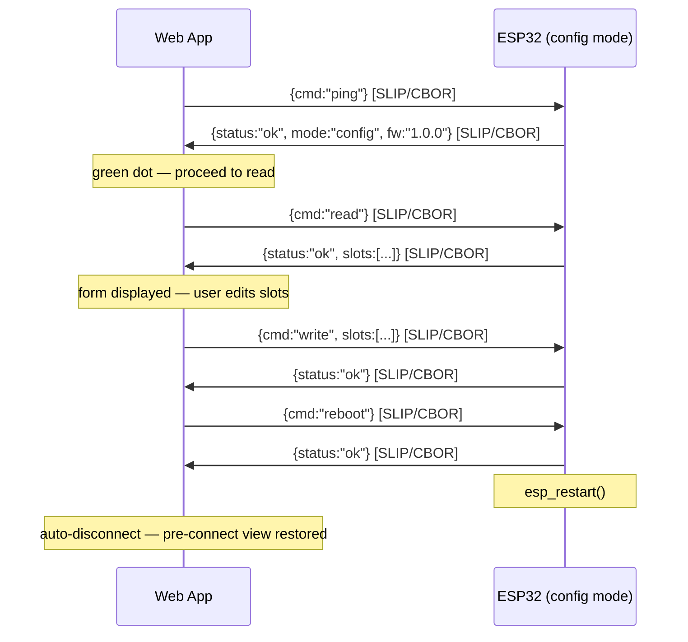
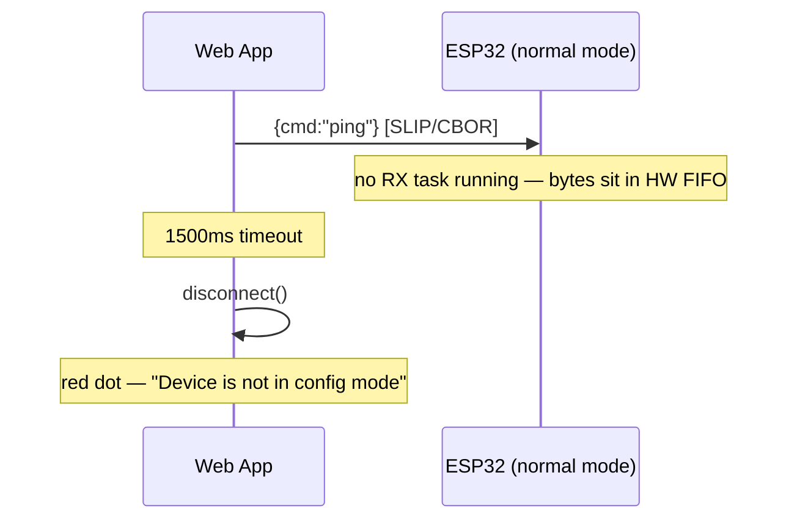

# Web Serial + CBOR switch configurator

**Beads issue**: Matter-M5CoreInk-Switch-kc5

## Context
The 16-switch NVS config (line1, line2, enabled) currently has no user-facing way to be changed. We need a browser-based configuration tool that connects via serial to read/write the switch config, then reboots the device. The ESP32-PICO-D4 uses a CP2104/CH9102F USB-serial bridge (no native USB), so we use the **Web Serial API** (not WebUSB). The serial protocol uses **CBOR** (TinyCBOR already available as `espressif__cbor`) with SLIP framing to distinguish binary commands from text log lines.

## Architecture

```
Browser (Web Serial API)  ←→  UART0 @ 115200  ←→  ESP32 command handler
         ↓                                              ↓
   web/index.html                              main/app_serial.cpp
   (CBOR + SLIP)                               (CBOR + SLIP + NVS)
```

## Serial Protocol

### Framing: SLIP (RFC 1055)
Binary CBOR payloads are wrapped in SLIP frames to separate them from ASCII log output:
- `0xC0` = frame END delimiter
- `0xDB 0xDC` = escaped `0xC0`
- `0xDB 0xDD` = escaped `0xDB`

The web app scans the byte stream: anything between two `0xC0` delimiters is a SLIP-decoded CBOR message. All other bytes (ASCII log lines) are ignored (or optionally displayed in a console pane).

### Commands (web → device)

**Ping (handshake):**
```cbor
{ "cmd": "ping" }
```

**Read all slots:**
```cbor
{ "cmd": "read" }
```

**Write slots:**
```cbor
{ "cmd": "write", "slots": [ { "l1": "Kitchen", "l2": "Light", "en": true }, ... ] }
```
(Full array of 16 entries required)

**Reboot:**
```cbor
{ "cmd": "reboot" }
```

### Responses (device → web)

**Ping response:**
```cbor
{ "status": "ok", "mode": "config", "fw": "1.0.0" }
```

**Read response:**
```cbor
{ "status": "ok", "slots": [ { "l1": "Switch", "l2": "1", "en": true }, ... ] }
```
(Array of 16 entries, index = slot number)

**Write response:**
```cbor
{ "status": "ok" }
```
or
```cbor
{ "status": "error", "msg": "l1 too long" }
```

**After successful write + reboot command:** device calls `esp_restart()`.

### Handshake / Config Mode Detection

After opening the serial port, the webapp sends `ping` before doing anything else. This detects whether the device is in config mode.

**Why this is needed:** In normal (Matter) mode, no UART RX task is running — UART0 is used only by ESP-IDF logging. Any command sent is silently ignored. Without a handshake the webapp would show "Connected" but every command would timeout.

**Timeout:** 1500ms. In config mode the round-trip is <100ms; a timeout means no RX task is active.

**Connection flow — config mode (success):**



**Connection flow — normal mode (failure):**



**On failure**, the webapp disconnects and shows: *"Device is not in config mode. Hold the top button while powering on, then reconnect."*

### Validation (firmware side, on write)
- `l1`: string, max 8 chars, non-empty
- `l2`: string, max 8 chars, non-empty
- `en`: boolean
- Reject unknown keys
- At least 1 slot must remain enabled (prevent bricking the UI)

### Validation (firmware side, on boot/read from NVS)
- If a string exceeds 8 chars, truncate
- If `en` is not 0 or 1, default to 0
- If no slots are enabled, force slot 0 enabled
- If `sel_sw` >= enabled count, clamp to 0

## Files

### New files

**`main/app_serial.cpp`** — UART command handler
- Registers a FreeRTOS task that reads UART0
- SLIP frame detection → CBOR decode → dispatch command → CBOR encode response → SLIP frame → UART write
- Uses existing `app_switch_config_init()` / `app_switch_get_config()` for reads
- Writes directly to NVS namespace `"app_state"` using same key scheme as `app_driver.cpp`
- Calls `esp_restart()` on reboot command

**`main/app_serial.h`** — public API
- `esp_err_t app_serial_init(void);` — called from `app_main()` after NVS init

**`web/index.html`** — self-contained web configurator
- Web Serial API connection (115200 baud)
- SLIP framing + CBOR encode/decode (inline minimal JS library)
- UI: table of 16 switch slots, each with line1/line2 text inputs + enabled checkbox
- "Read from device" button → sends read command, populates form
- "Write to device" button → validates, sends write + reboot commands
- Status indicator (connected/disconnected)

### Modified files

**`main/app_main.cpp`** — add `app_serial_init()` call after NVS init, before Matter start

**`main/app_driver.cpp`** — add boot-time NVS validation (truncate, clamp, force-enable)

**`main/CMakeLists.txt`** — add `app_serial.cpp` to SRCS

## Boot-time NVS validation (app_driver.cpp)

Add to `app_switch_config_init()`:
1. After loading all 16 configs, verify each:
   - If `line1` is empty, set to `"Switch"`
   - If `line2` is empty, set to slot number as string
   - Strings are already length-bounded by `nvs_get_str` with `sizeof(line1)` = 9
2. If `s_enabled_count == 0`, force `s_configs[0].enabled = true` and write back to NVS
3. After loading `sel_sw`, clamp: `if (val >= s_enabled_count) val = 0`

## Web app UI sketch

```
┌─────────────────────────────────────────┐
│  M5 Multipass Configurator    [Connect] │
├─────────────────────────────────────────┤
│  #  │ Line 1    │ Line 2    │ Enabled   │
│  1  │ [Switch ] │ [1      ] │ [✓]       │
│  2  │ [Switch ] │ [2      ] │ [✓]       │
│  3  │ [Switch ] │ [3      ] │ [✓]       │
│  4  │ [Switch ] │ [4      ] │ [✓]       │
│  5  │ [Switch ] │ [5      ] │ [ ]       │
│ ... │           │           │           │
│ 16  │ [Switch ] │ [16     ] │ [ ]       │
├─────────────────────────────────────────┤
│  [Read from Device]  [Write to Device]  │
│  Status: Connected                      │
└─────────────────────────────────────────┘
```

## Verification
1. Build firmware, flash, connect via `make monitor` — device boots normally with log output
2. Open `web/index.html` in Chrome, click Connect, pick the serial port
3. Click "Read from Device" — table populates with current NVS config
4. Change slot 5 to enabled, set line1="Garage", line2="Door"
5. Click "Write to Device" — device reboots, now shows 5 switches in navigation
6. Test edge cases: empty strings, 8+ char strings, disable all (should reject)
